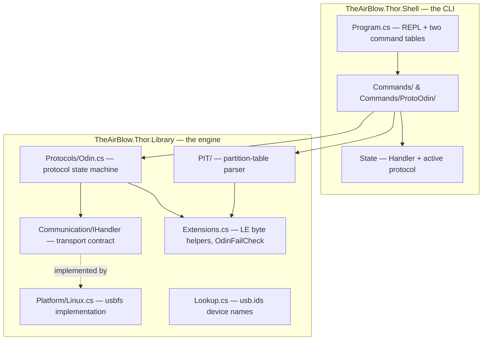

# Thor — Internals Documentation

Human-readable documentation of every logic module and protocol in the Thor Flash Utility,
written from a full read of the source. It doubles as a **reimplementation spec**: precise
enough that you could rebuild Thor in another language from these pages alone.

> **What Thor is:** an open-source, from-scratch clone of Samsung's **Odin** firmware
> flasher (and a rival to Heimdall), written in **C# / .NET 9** (AOT-compiled). It talks to
> Samsung phones in **download mode** over USB to flash firmware, read/write the partition
> table, erase partitions, factory-reset, change the region code, and reboot. Today it is
> **Linux-only**; Windows and macOS are stubbed but unimplemented.
>
> Note: the top-level project `README.md` still says ".NET 7" — the `.csproj` files target
> **`net9.0`** with `PublishAot`, so that line is stale.

## Start here

| If you want to… | Read |
|-----------------|------|
| Understand the wire protocol (opcodes, packets, flashing) | [**odin-protocol.md**](odin-protocol.md) ★ |
| Understand the partition table format | [**pit-format.md**](pit-format.md) |
| Understand the native USB layer (and how to port it) | [**usb-transport.md**](usb-transport.md) |
| Understand the interactive CLI and every command | [**shell.md**](shell.md) |
| See one flash traced through all four layers | [**end-to-end-flash.md**](end-to-end-flash.md) |

## The architecture in one picture

Thor is two projects with a clean seam between them. The **Library** is the reusable engine
(no UI); the **Shell** is a thin interactive skin over it.

**The one seam that matters:** everything protocol-side depends only on the `IHandler`
interface, never on Linux directly. That's what makes a Windows/macOS port a matter of
writing *one* class — see [usb-transport.md](usb-transport.md#what-a-windowsmacos-port-must-supply).

## The module map

| Module | File(s) | One-line job |
|--------|---------|--------------|
| **Odin protocol** | `Protocols/Odin.cs`, `Protocols/Protocol.cs` | the ODIN⇄LOKE request/ack state machine — handshake, sessions, PIT dump/flash, partition flashing, erase, reboot |
| **Byte helpers** | `Extensions.cs` | little-endian read/write, packet padding (`OdinAlign`), and `OdinFailCheck` error decoding |
| **PIT parser** | `PIT/PitData.cs`, `PIT/PitEntry.cs`, `PIT/FieldMapper.cs` | parse the partition table; map raw ints to human labels; guess old-vs-new generation |
| **Transport contract** | `Communication/IHandler.cs`, `Communication/DeviceInfo.cs`, `Communication/USB.cs` | the interface every transport implements + the platform registry (vendor `0x04E8`) |
| **Linux transport** | `Platform/Linux.cs` | native usbfs: descriptor parsing, `ioctl` bulk transfers, kernel-driver detach |
| **Device names** | `Lookup.cs` | download/cache `usb.ids`, resolve vendor/product to a display name |
| **Shell** | `Program.cs`, `State.cs`, `ICommand.cs`, `FailInfo.cs`, `Commands/**` | REPL, shared state, command contract, error carets, and all commands |

## The five things that make Thor unusual

If you remember only a handful of ideas from this codebase, make it these — each is
explained in depth in the linked page:

1. **It speaks USB with no USB library.** Raw `/dev/bus/usb` + `ioctl`, mirroring official
   Odin-for-Linux. → [usb-transport.md](usb-transport.md)
2. **The protocol is dead simple on the wire.** 1024-byte command, 8-byte ack, a `0xFF`
   first byte for failure. The complexity is all in the *flashing sequence math*, not the
   framing. → [odin-protocol.md](odin-protocol.md)
3. **The bootloader version reconfigures the whole session** — packet size, timeouts,
   sequence count — from a single number returned by `BeginSession`. →
   [odin-protocol.md](odin-protocol.md#the-flash-sequence-math-the-part-that-bites)
4. **The PIT format carries no version flag**, so Thor *guesses* the generation from whether
   a field varies between partitions. → [pit-format.md](pit-format.md#the-old-vs-new-heuristic-and-why-its-fragile)
5. **The shell unlocks and overrides commands by session state**, via two lookup tables. →
   [shell.md](shell.md#the-two-table-command-model-the-clever-part)

## Known rough edges (surfaced by this documentation)

Not bugs that stop it working — things a reader or a porter should know:

- `FieldMapper.GetMapping` has an **off-by-one** bounds guard (`>` should be `>=`). →
  [pit-format.md](pit-format.md#a-latent-bug-worth-documenting)
- Two command help strings are **copy-paste wrong** (`flashPit` and `erasePartition`). →
  [shell.md](shell.md#two-copy-paste-bugs-in-the-help-strings)
- The **write-side ZLP path is dormant** (`_writeZlp` is never set true). →
  [usb-transport.md](usb-transport.md#the-zero-length-packet-quirk-and-a-dormant-path)
- `disconnect` **doesn't fully reset session state**. → [shell.md](shell.md#shared-state-state)
- `SharpCompress` is a **referenced-but-unused** dependency (verified by full-tree grep).
- The project `README.md` still advertises **.NET 7**, but the code targets **.NET 9**.

## Verified vs. inferred (globally)

Everything in these docs was read out of the source in this repo. Concrete facts — opcodes,
byte offsets, sizes, timeouts, error codes, control flow — are **verified**. A few
*interpretations* (what `Unknown1`/`Unknown2` mean, why the packet size split tracks a real
bootloader generation, the naming of protocol regions) are **inferred** and labelled as such
on each page. The two devices the author actually tested are listed in the project README;
these docs describe the code's behavior, which is broader than what's been field-verified on
hardware.

## The frontier (what to learn or check next)

- **What `Unknown1`/`Unknown2` select** in the bootloader version — the one place the
  original author explicitly asks for help; likely the door to undiscovered features.
- **Whether any real device needs write-side ZLPs** — the justification for wiring the
  dormant `_writeZlp` path.
- **A Windows/macOS `IHandler`** — the highest-leverage enhancement, and the seam is already
  clean.
