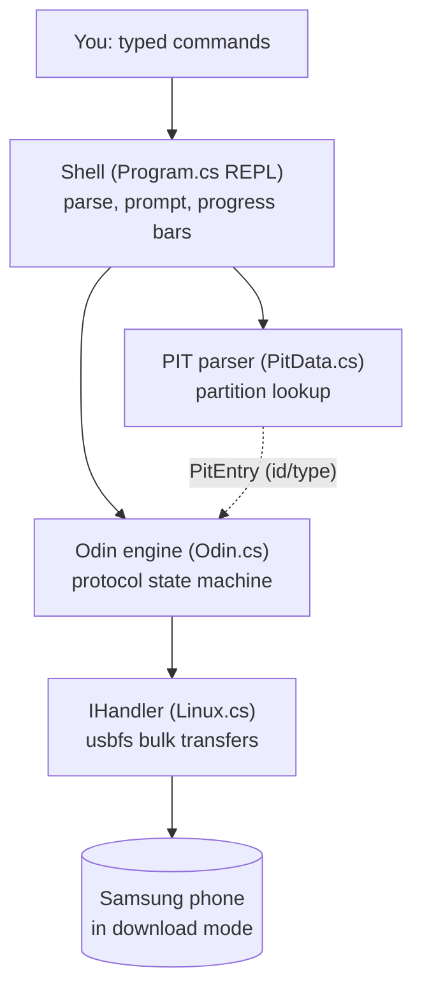
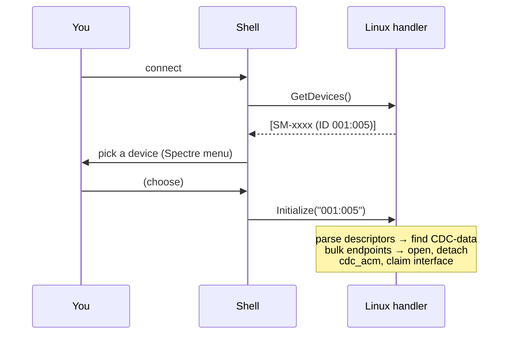
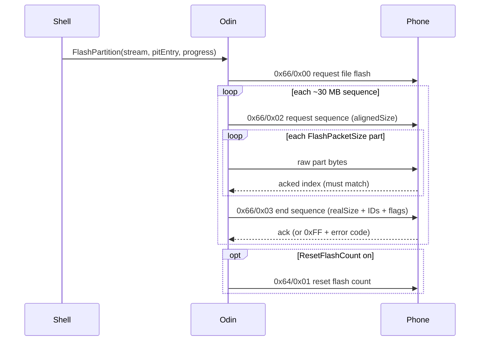

# End-to-End: what happens when you flash

> This ties the four modules together on one real path. Cross-references:
> [shell](shell.md) · [Odin protocol](odin-protocol.md) · [PIT](pit-format.md) ·
> [USB transport](usb-transport.md).

The best way to understand Thor is to follow one command all the way down to the wire.
We'll trace **`flashTar ./firmware`** — flashing a folder of Odin `.tar.md5` archives —
because it exercises every layer: the shell, the PIT parser, the Odin protocol, and the USB
transport. Every step below maps to real code.

## The layers, top to bottom



The shell orchestrates; the Odin engine speaks the protocol; the PIT parser answers "which
partition is this file?"; the handler moves bytes. Nothing skips a layer.

## The full session, command by command

A real flashing session is four typed commands. Here's what each one sets in motion.

### 1. `connect`



At the end of this, `State.Handler` is a live, claimed USB interface. Still **no protocol** —
`ProtocolType` is `None`. Details: [USB transport → Initialize](usb-transport.md#opening--claiming-a-device-initialize).

### 2. `begin odin`

```csharp
var odin = new Odin(state.Handler);
state.Protocol = odin;              // stash the engine in State
odin.Handshake();                   // "ODIN" → "LOKE"
odin.BeginSession();                // 0x64/0x00 → bootloader version
state.ProtocolType = Protocol.Odin; // unlock the flashing commands
```

The `BeginSession` reply is where the session **retunes itself**: the bootloader version
picks 128 KiB vs 1 MiB packets and the 30 s vs 120 s commit timeout for everything that
follows. If `Version >= 2`, Thor also sends `0x64/0x05` to announce its packet size. From
here, the proto-command table is active, so `flashTar` etc. exist. Details:
[Odin protocol → session](odin-protocol.md#region-0x64--session-control).

### 3. `flashTar ./firmware` — the heart of it

This one command runs a **plan → confirm → execute** shape.

**Phase A — build the plan (read-only):**

1. Pull the live partition map: `odin.DumpPIT()` → `new PitData(buf)`. This is a full
   `0x65` dump: request (get size), read ⌈size/500⌉ blocks of 500 bytes, drain the ZLP, end.
   ([protocol](odin-protocol.md#region-0x65--pit-partition-table) ·
   [PIT parse](pit-format.md#the-binary-layout))
2. For each `.tar`/`.tar.md5` in the folder, list its top-level files and **match each one to
   a PIT entry by `FileName`** (this is why the PIT matters — it turns `boot.img` into a
   `PitEntry` carrying `PartitionId`, `BinaryType`, `DeviceType`).
3. Show a multi-select menu; you tick the partitions to flash. Nothing has touched the
   device's storage yet.

**Phase B — confirm:**

Thor lists every chosen partition and asks *"Are you absolutely sure?"* (defaulting to No).
This is the last exit.

**Phase C — execute (destructive):**

```csharp
odin.SetTotalBytes(totalBytes);          // 0x64/0x02 — announce the grand total
foreach (chosen partition) {
    var stream = entry.DataStream;
    if (name endsWith ".lz4") stream = LZ4Stream.Decode(stream);  // transparent decompress
    odin.FlashPartition(stream, pitEntry, progressCallback);
}
```

Inside `FlashPartition`, the [sequence math](odin-protocol.md#the-flash-sequence-math-the-part-that-bites)
takes over: the image is cut into ~30 MB sequences, each sequence into `FlashPacketSize`
parts, each part is one `BulkWrite` whose acknowledged index is checked. Each sequence ends
with the structured `0x66/0x03` packet carrying `realSize` + the partition's IDs + the
EFS/bootloader/last flags. The `progressCallback` feeds the Spectre progress bar (bytes sent,
sequence N of M, "Sending" vs "Flashing").



If any ack comes back `0xFF`, `OdinFailCheck` throws with the decoded reason (`-5 Auth`,
`-2 WP`, …), the exception bubbles up to the command, and the shell prints it in red. A
failed flash stops the loop.

### 4. `reboot normal` (or `end`)

`reboot` sends `EndSession` (`0x67/0x00`), clears the protocol state, sends `Reboot`
(`0x67/0x01`), and disconnects the handler. The phone leaves download mode and boots the
firmware you just wrote.

## How the other flashing commands are variations on this

Once you see `flashTar`, the rest are the same skeleton with a different front end:

| Command | Difference from `flashTar` |
|---------|-----------------------------|
| `flashFile` | one file, one partition (auto-matched or picked); same `SetTotalBytes` + `FlashPartition` |
| `erasePartition` | `FlashPartition(**null** stream, entry, …, length)` — a null stream means every part is zero-filled, so it writes zeros = erase |
| `factoryReset` | skips `FlashPartition` entirely; one `EraseUserData` (`0x64/0x07`) call |
| `flashPit` | validates the PIT parses, then `FlashPIT` (`0x65` write path) — replaces the map itself |
| `dumpPit` | just the read half of `flashTar`'s Phase A, written to a file |

They all share the same three ingredients: a `PitEntry` for addressing, the `FlashPartition`
sequence engine, and the `IHandler` for bytes.

## The mental model to keep

- **The shell decides *what*; the engine decides *how*; the handler moves bytes.** Keep those
  responsibilities separate and the system stays comprehensible.
- **The PIT is the phone's self-description**, fetched fresh each operation, and it's what
  lets a filename become a hardware address.
- **`BeginSession` configures the session**; everything downstream depends on the version it
  returns.
- **Every destructive step is gated by a default-No confirmation** — a design choice worth
  preserving in any port.

## Where to go next

- Porting to Windows/macOS? Start at [USB transport → what a port must supply](usb-transport.md#what-a-windowsmacos-port-must-supply)
  — the `IHandler` seam is the only platform-specific surface.
- Reimplementing the protocol in another language? [odin-protocol.md](odin-protocol.md) is
  written to be sufficient on its own, opcode for opcode.
