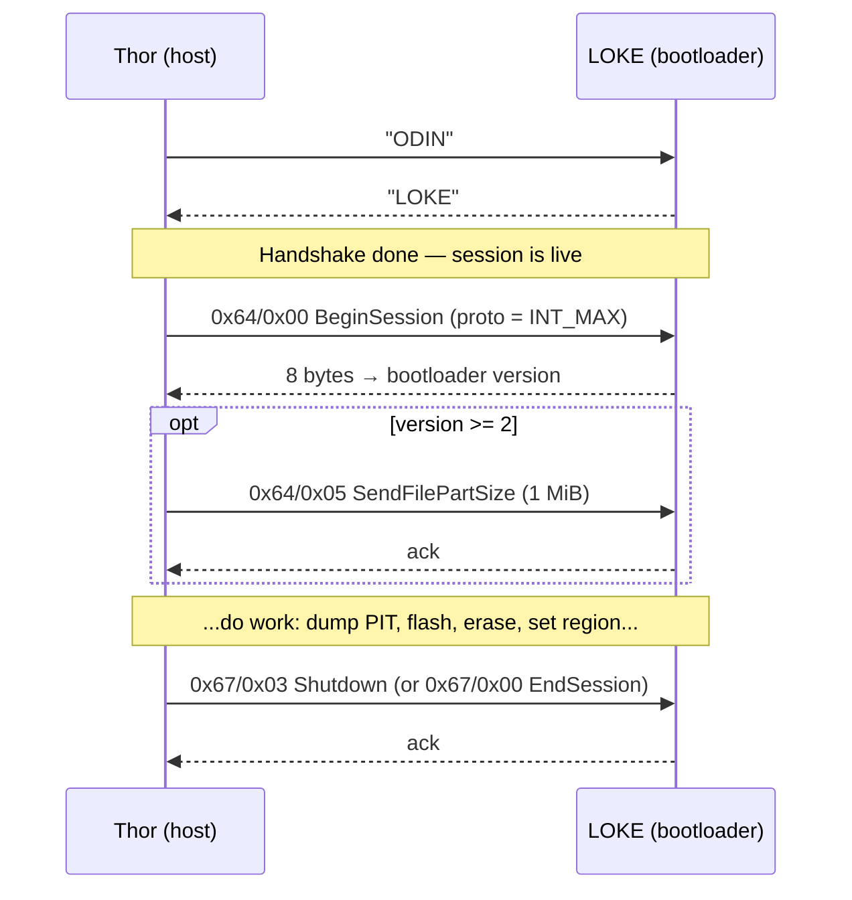

# The Odin Protocol (ODIN ⇄ LOKE)

> Source of truth: [`TheAirBlow.Thor.Library/Protocols/Odin.cs`](../TheAirBlow.Thor.Library/Protocols/Odin.cs)
> and the byte helpers in [`Extensions.cs`](../TheAirBlow.Thor.Library/Extensions.cs).
> Everything here was read out of the code, not from a leaked spec. Where a value's
> *meaning* is guessed rather than proven, it says so.

## The one-sentence version

Odin is a **request → acknowledge** protocol spoken over two USB bulk endpoints. Thor
always talks first with a fixed-size command packet; the phone's bootloader (which calls
itself **LOKE**) always answers with a short status packet. There is no framing, no
checksums, no length prefixes on the wire — just "I send 1024 bytes, you send 8 bytes
back, and the first byte of your reply tells me if it went wrong."

That simplicity is the whole reason a from-scratch clone is even possible.

## Why "ODIN" and "LOKE"

When the phone is in download mode, its bootloader is listening for a literal
password. Thor opens every connection by sending the four ASCII bytes `O D I N`; a
genuine Samsung download-mode bootloader replies with the four ASCII bytes `L O K E`
(Loki — the code name Samsung uses internally). If you get anything else back, you are
not talking to a Samsung bootloader and Thor aborts immediately.

```csharp
// Odin.cs — Handshake()
_handler.BulkWrite("ODIN");      // 4 bytes out
var buf = _handler.BulkRead(4);  // 4 bytes in
if (buf != "LOKE") throw ...;    // wrong device / wrong mode
```

**Stakes:** the handshake is the entire authentication. There is no key exchange. If
`LOKE` comes back, you have a live session and every destructive command below will be
obeyed.

## Anatomy of a packet

Two shapes cover the whole protocol.

### Command packet (host → device): always 1024 bytes

Thor allocates `new byte[1024]` for **every** command, writes a few fields into the
front, and sends the whole kilobyte — trailing bytes stay zero. Fields are written
**little-endian** (see `WriteInt`/`WriteLong` in `Extensions.cs`).

| Offset | Size | Field | Meaning |
|-------:|-----:|-------|---------|
| 0 | 4 | **Region** | Which command family (see table below) |
| 4 | 4 | **Sub-command** | Which action inside that family |
| 8 | … | Arguments | Command-specific; often one int or long |

That's it. The region+sub-command pair at bytes 0–7 is the "opcode"; anything after byte
8 is arguments. The 1024-byte padding is not decoration — the bootloader expects packets
of that size on the control path (the shell's `write` command even exposes an
`OdinAlign()` helper that pads raw bytes to 1024 for exactly this reason).

### Reply packet (device → host): usually 8 bytes

| Offset | Size | Field | Meaning |
|-------:|-----:|-------|---------|
| 0 | 4 | **Status / echo** | `0xFF` in byte 0 means failure; otherwise success |
| 4 | 4 | **Return value** | Command-specific payload (version, size, index…) |

Thor reads exactly 8 bytes after most commands and calls `OdinFailCheck` on them. **The
failure signal is a single byte:** if `buf[0] == 0xFF`, it reads a signed 32-bit error
code from bytes 4–7 and throws. On success the same bytes 4–7 carry useful data — the
bootloader version, the PIT size, the acknowledged packet index, and so on. Same slot,
two meanings, disambiguated only by byte 0.

## A whole session at a glance



The `BeginSession` reply is the hinge of the whole protocol: it hands back a version
number that **retunes every timing and sizing constant for the rest of the session**
(next section).

## The command map (regions & sub-commands)

Four regions. Every method in `Odin.cs` is one row here. "Args" lists what Thor writes
after byte 8; "Reply" notes anything it reads out of bytes 4–7.

### Region `0x64` — Session control

| Sub | Method | Args (offset → value) | Reply / notes |
|----:|--------|-----------------------|---------------|
| `0x00` | `BeginSession` | 8 → `int.MaxValue` (proto version, deliberately maxed to catch-all every bootloader) | bytes 4–7 = version integer → split into `Unknown1`, `Unknown2`, `Version` |
| `0x05` | *(send file part size)* | 8 → `FlashPacketSize` | **only sent when `Version >= 2`**; tells the device the chunk size Thor will use |
| `0x01` | *(reset flash count)* | none | sent after a flash if `ResetFlashCount` is on; clears the Knox/flash counter |
| `0x02` | `SetTotalBytes` | 8 → total (`long`, 8 bytes) | announces the grand total to be flashed, for the device's progress/verify |
| `0x07` | `EraseUserData` | none | NAND-erase userdata (factory reset); **10-minute timeout** |
| `0x08` | `EnableTFlash` | none | flash to SD card instead of internal storage |
| `0x08` | `SetRegionCode` | 8 → 3-char CSC code | **same opcode as EnableTFlash** — see trap below |

### Region `0x65` — PIT (partition table)

The meaning of sub-command `0x02` depends on whether you are dumping or flashing.

| Sub | Context | Method | Args | Reply / notes |
|----:|---------|--------|------|---------------|
| `0x01` | dump | `DumpPIT` step 1 | none | bytes 4–7 = PIT size in bytes; blocks = ⌈size / 500⌉ |
| `0x02` | dump | `DumpPIT` step 2 | 8 → block index | reply is a **500-byte** data block, not an 8-byte ack |
| `0x03` | dump | `DumpPIT` step 3 | none | end dump (8-byte ack) |
| `0x00` | flash | `FlashPIT` step 1 | none | request permission to flash a PIT |
| `0x02` | flash | `FlashPIT` step 2 | 8 → PIT length | begin; then Thor bulk-writes the raw PIT bytes |
| `0x03` | flash | `FlashPIT` step 3 | none | end flash |

After the last dump block, Thor reads a **zero-length packet** (`ReadZLP`) to drain the
endpoint; it is wrapped in `try/catch` because not every device sends one.

### Region `0x66` — Flashing (the hot path)

| Sub | Method step | Args | Reply / notes |
|----:|-------------|------|---------------|
| `0x00` | request file flash | none | permission to begin a partition |
| `0x02` | request sequence flash | 8 → `alignedSize` | announces the size of the next ~30 MB sequence |
| *(data)* | send file part | — | raw `FlashPacketSize` chunk; reply bytes 4–7 = acknowledged part index, which **must equal** the index Thor sent, or it aborts |
| `0x03` | end sequence flash | see layout below | commits the sequence; read with the version-based `FlashTimeout` |

The `0x66/0x03` "end sequence" packet is the most structured message in the protocol,
and it has **two layouts** chosen by the partition's `BinaryType`:

**Phone/AP firmware (`BinaryType != 1`):**

| Offset | Value |
|-------:|-------|
| 8  | `0x00` (phone) |
| 12 | `realSize` (true unpadded byte count of this sequence) |
| 16 | `entry.BinaryType` |
| 20 | `entry.DeviceType` |
| 24 | `entry.PartitionId` |
| 28 | `1` if last sequence else `0` |
| 32 | `1` if EFS-clear enabled else `0` |
| 36 | `1` if bootloader-update enabled else `0` |

**Modem/CP firmware (`BinaryType == 1`):**

| Offset | Value |
|-------:|-------|
| 8  | `0x01` (modem) |
| 12 | `realSize` |
| 16 | `entry.BinaryType` |
| 20 | `entry.DeviceType` |
| 24 | `1` if last sequence else `0` |

Note the modem layout has no `PartitionId`, no EFS/bootloader flags — the device already
knows where modem firmware goes.

### Region `0x67` — End & power

| Sub | Method | Effect |
|----:|--------|--------|
| `0x00` | `EndSession` | close the session cleanly, leave device in download mode |
| `0x01` | `Reboot` | reboot into normal Android |
| `0x02` | `RebootToOdin` | reboot back into download mode (**not supported on every device** — the shell falls back to a normal reboot if it fails) |
| `0x03` | `Shutdown` | power the device off |

## The flash-sequence math (the part that bites)

This is where a naïve reimplementation goes wrong, so here is the whole chain.

A partition image is not sent in one blast. It is cut into **sequences** of ~30 MB, each
sequence is cut into **parts** of exactly `FlashPacketSize`, and each part is one bulk
write. Two constants, both set from the bootloader version at `BeginSession`, drive
everything:

| Bootloader `Version` | `FlashPacketSize` | `FlashSequence` | Sequence size | `FlashTimeout` |
|---------------------:|------------------:|----------------:|--------------:|---------------:|
| 0 or 1 | 131072 (128 KiB) | 240 | 240 × 128 KiB ≈ **30 MB** | 30 s |
| ≥ 2    | 1048576 (1 MiB)  | 30  | 30 × 1 MiB ≈ **30 MB**    | 120 s |

**The trap:** both versions land on ~30 MB per sequence, but via completely different
part sizes (128 KiB vs 1 MiB). If you hardcode one, half the devices fail. The sequence
*size in bytes* is coincidentally the same; the *packetization* is not.

The per-partition loop (`FlashPartition`):

```
sequence      = FlashPacketSize * FlashSequence          // ≈ 30 MB
sequences     = length / sequence                        // integer division
lastSequence  = length % sequence
if lastSequence != 0:  sequences++                        // partial final sequence
else:                  lastSequence = sequence            // exact multiple

for i in 0 .. sequences-1:
    realSize    = (last sequence) ? lastSequence : sequence
    alignedSize = realSize rounded UP to a multiple of FlashPacketSize
    send 0x66/0x02 with alignedSize
    parts = alignedSize / FlashPacketSize
    for j in 0 .. parts-1:
        read FlashPacketSize bytes from the image (short read → zero-padded)
        bulk-write the part
        device replies with the part index; assert it == j
    send 0x66/0x03 end-sequence with realSize + flags
```

Two subtleties worth internalizing:

- **`alignedSize` vs `realSize`.** On the wire Thor always sends whole `FlashPacketSize`
  packets, so the last part of the last sequence is padded with zeros up to the packet
  boundary (`alignedSize`). But the end-sequence message reports `realSize`, the true
  byte count, so the device writes the real length and discards the padding. Send the
  aligned size, *declare* the real size.
- **The index handshake.** After every part the device echoes back the index it just
  accepted. Thor checks `index == j` and aborts on mismatch. This is the protocol's only
  per-part integrity check — there is no CRC.

## Error codes

`OdinFailCheck` (in `Extensions.cs`) fires whenever a reply's byte 0 is `0xFF`. The
signed int at bytes 4–7 is the code. Only the **end-of-sequence** check decodes them into
names (the `end: true` path); everywhere else you just get the raw hex code.

| Code | Name | Plain meaning |
|-----:|------|---------------|
| `-2` | WP | Write-protected — the partition refused the write |
| `-3` | Erase | Erase step failed |
| `-4` | Write | Write step failed |
| `-5` | Auth | Signature/authentication rejected (unsigned or wrong-model firmware) |
| `-6` | Size | Size mismatch |
| `-7` | Ext4 | Ext4-specific failure |

**Stakes:** `-5 Auth` is the one you'll hit flashing firmware from the wrong model or
region — the bootloader verifies signatures and rejects mismatches. Thor can't bypass
that; it only reports it.

## Timeouts (all in milliseconds)

Timeouts matter because a too-short one aborts a legitimate slow operation, and a
too-long one hangs on a dead device.

| Operation | Timeout | Why |
|-----------|--------:|-----|
| Ordinary command/ack | 5000 | default in `BulkWrite`/`BulkRead` |
| End-of-sequence flash (v0/1) | 30000 | the device is committing ~30 MB |
| End-of-sequence flash (v2+) | 120000 | larger commits on newer bootloaders |
| `EraseUserData`, `EnableTFlash`, `SetRegionCode` | 600000 | NAND erase can take minutes |
| `FlashPIT` (sending the blob) | 120000 | |
| Zero-length packet drain | 100 | best-effort, allowed to fail |

## Traps & sharp edges (read before porting)

- **`0x64/0x08` is overloaded.** `EnableTFlash` and `SetRegionCode` send the *same*
  region+sub-command. The device tells them apart purely by payload: T-Flash sends
  nothing after byte 8; region-set writes a 3-byte code there. Get the payload wrong and
  you'll silently invoke the wrong feature.
- **`0x65/0x02` means two different things** depending on whether you're mid-dump (read
  block N) or mid-flash (begin with size). The region is stateful.
- **`BeginSession` sends `int.MaxValue` as the protocol version** on purpose — it's a
  "catch-all" so the bootloader doesn't gate features by a version Thor would otherwise
  have to negotiate. Clever, and load-bearing.
- **`Unknown1`/`Unknown2`** in the version reply are almost always zero. When they aren't,
  Thor literally prints "please contact TheAirBlow on XDA" — they mark undiscovered
  bootloader capabilities. If you port this, keep those bytes; don't assume zero.
- **Erase is just a flash of zeros.** `erasePartition` calls `FlashPartition` with a
  `null` stream, so every part buffer stays zero-filled and the partition gets overwritten
  with zeros for the declared length. There is no dedicated "erase partition" opcode; only
  `EraseUserData` (0x64/0x07) is special-cased.

## Verified vs. inferred

- **Verified from source:** every opcode, offset, size, timeout, and error code above is
  read directly out of `Odin.cs` / `Extensions.cs`.
- **Inferred (meaning, not values):** the *names* "session/PIT/flash/end" for the regions,
  the interpretation of `Unknown1/2` as capability flags, and the claim that the 1 MiB vs
  128 KiB split tracks a real bootloader-generation change rather than an arbitrary tuning
  choice. The code proves the numbers; it doesn't prove the story behind them.
- **The next real unknown:** what `Unknown1`/`Unknown2` actually select. That's the
  frontier the original author flags in-code, and it's where new features would come from.

See also: [PIT format](pit-format.md) · [USB transport](usb-transport.md) ·
[end-to-end flash walkthrough](end-to-end-flash.md).
