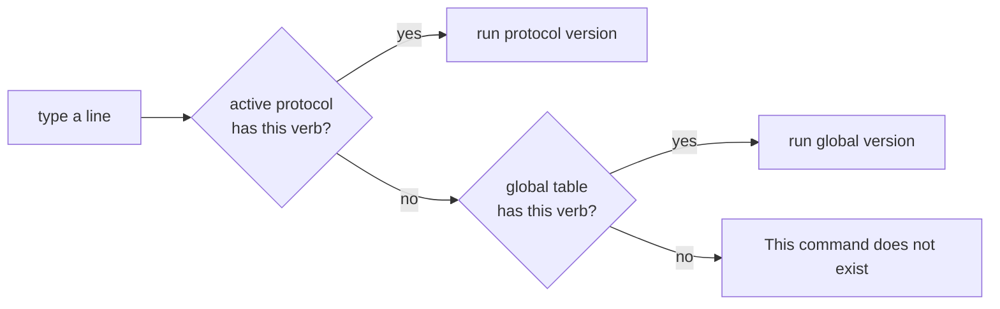

# The Shell (interactive REPL)

> Source of truth: [`Program.cs`](../TheAirBlow.Thor.Shell/Program.cs),
> [`State.cs`](../TheAirBlow.Thor.Shell/State.cs),
> [`ICommand.cs`](../TheAirBlow.Thor.Shell/ICommand.cs),
> [`FailInfo.cs`](../TheAirBlow.Thor.Shell/FailInfo.cs),
> and everything under [`Commands/`](../TheAirBlow.Thor.Shell/Commands/).

## What it is

`TheAirBlow.Thor.Shell` is the user-facing program: a small **read-eval-print loop** that
turns typed lines like `flashTar ./firmware` into calls on the `Odin` engine. It owns no
protocol knowledge itself — it parses arguments, prompts for confirmation, renders progress
bars (via Spectre.Console), and delegates every real action to the library. Think of it as a
thin, friendly skin over `Odin.cs` and the USB handler.

## Startup sequence

Before the prompt appears, `Program.cs` (a top-level-statements file — there's no `Main`
method) does four things in order:

1. **Configure logging** — Serilog to console, at `Information` level (the `debug` command
   later swaps this for `Debug`).
2. **Pick a USB handler** — `USB.TryGetHandler`. If the platform has none (Windows/macOS
   today), it prints the unsupported message and exits *before* the loop ever starts.
3. **Load `usb.ids`** — `Lookup.Initialize()` downloads the linux-usb.org name database on
   first run and caches it to `usb.ids`, so device pickers can show real product names. If
   the download fails, names just show as unknown; it's non-fatal.
4. **Print platform notes** — `handler.GetNotes()` (the root/udev/`cdc_acm` advice).

Then it builds the command tables and enters the loop.

## The two-table command model (the clever part)

There are **two** dictionaries of commands, and which one wins depends on session state:

```csharp
Dictionary<string, ICommand> commands;                                  // always available
Dictionary<Protocol, Dictionary<string, ICommand>> protoCommands;       // per-protocol
```

- `commands` holds the **global** verbs: `connect`, `begin`, `end`, `disconnect`, `read`,
  `write`, `printPit`, `devParse`, `debug`.
- `protoCommands[Protocol.Odin]` holds the verbs that only make sense **inside** an Odin
  session: `flashFile`, `flashTar`, `flashPit`, `dumpPit`, `printPit`, `write`,
  `erasePartition`, `factoryReset`, `setRegion`, `reboot`, `options`.

When you type a command, the loop looks in the **active protocol's table first**, then falls
back to the global table:

```csharp
if (!proto.TryGetValue(name, out var command))
    if (!commands.TryGetValue(name, out command))
        // "This command does not exist"
```

Two consequences fall out of that ordering:

- **New verbs unlock** once you `begin odin` (all the flashing commands appear).
- **Existing verbs can be overridden.** `printPit` and `write` exist in *both* tables; in a
  session you transparently get the Odin-aware versions — `printPit` can pull the PIT live
  off the device, and `write` pads packets to 1024 bytes. The help text even calls this out:
  *"beginning a protocol session unlocks new commands… they can also override the default
  commands."*



## Shared state: `State`

One object threads through every command:

```csharp
public class State(IHandler handler) {
    public IHandler Handler { get; }          // the USB transport
    public Protocol ProtocolType { get; set; } // enum: None | Odin
    public object Protocol { get; set; }        // the live Odin instance (boxed as object)
}
```

`ProtocolType` selects which proto-table is active; `Protocol` holds the actual `Odin`
object, which session commands cast back with `(Odin)state.Protocol`. It's typed as `object`
so the shell can stay protocol-agnostic — a second protocol would slot in without changing
`State`.

> **State-handling wrinkle:** `disconnect` sets `state.Protocol = Protocol.None` (assigning
> the *enum* to the *object* field) and never resets `state.ProtocolType`. So disconnecting
> mid-session leaves `ProtocolType == Odin` while the handler is gone. Minor, but a port
> should reset both fields together.

## The command contract: `ICommand`

Every command is one class implementing:

```csharp
public interface ICommand {
    FailInfo RunCommand(State state, List<string> args);  // args = tokens after the verb
    string GetDescription();                               // one-line help
}
```

`RunCommand` returns a `FailInfo`: a success sentinel (`new FailInfo()`) or a failure with a
message and the **index of the offending argument**. The loop prints failures; commands
print their own success output.

## Error reporting: the caret

`FailInfo.Print` does something genuinely nice for a CLI — it underlines the exact token you
got wrong with a `~~~^` caret, accounting for the 7-character `shell> ` prompt:

```
shell> begin banana
~~~~~~~~~~~~~^
Invalid option choice, should be [odin]
```

Argument index `0` points the caret at the command itself; higher indices walk across the
tokens. It's a small touch that makes argument mistakes obvious instead of cryptic.

## Command reference

Notation used by the help text: `[required]` = an option list, `<required>` = a normal
argument, `{optional}` / `(optional)` = optional.

### Global commands

| Command | What it does | Notes |
|---------|--------------|-------|
| `connect` | Enumerate Samsung devices and open one (interactive picker) | fails if already connected or none found |
| `begin [odin]` | Handshake + `BeginSession`, entering an Odin session | the only protocol implemented |
| `end` | End the session; tries `Shutdown`, falls back to `EndSession` | resets `ProtocolType`/`Protocol` |
| `disconnect` | Close the USB connection | see state wrinkle above |
| `read <amount>` | Raw `BulkRead`, dumped as hex + ASCII | debugging |
| `write [string/int/bytes] <content>` | Raw `BulkWrite`, **no** padding | debugging |
| `printPit <file>` | Parse a `.pit` file and render it as a tree | file only (see session version) |
| `devParse <path>` | Parse a saved `/dev/bus/usb` descriptor blob | pure diagnostics, no device needed |
| `debug [on/off]` | Toggle Serilog between `Debug` and `Information` | |
| `help`, `exit`/`quit` | Built into the loop itself | |

### Odin-session commands

| Command | What it does | Key behavior |
|---------|--------------|--------------|
| `flashTar <directory>` | Flash Odin `.tar` / `.tar.md5` archives from a folder | matches each archived file to a PIT partition by name, multi-select, double-confirm; decodes `.lz4` on the fly |
| `flashFile <filename>` | Flash a single image onto one partition | auto-matches partition by filename or prompts; decodes `.lz4`; confirm before writing |
| `flashPit <filename>` | Push a whole PIT file to the device | validates it parses first |
| `dumpPit <filename>` | Pull the device's PIT and save it to a file | |
| `printPit (filename)` | Print a PIT as a tree | **arg optional** — with no file it dumps live from the device |
| `erasePartition <size>` | Permanently erase a chosen partition | erases by *flashing zeros* over `<size>` bytes; double-confirm |
| `factoryReset` | `EraseUserData` (NAND-erase userdata) | can take minutes; confirm |
| `setRegion <code>` | Change the 3-letter CSC/region code | uppercased before sending |
| `reboot [odin/normal]` | End session then reboot | `odin` falls back to a normal reboot if the device can't re-enter download mode |
| `options [tflash/efsclear/blupdate/resetfc] (true/false)` | Get or set a flash option | with no value it *prints* the current one |
| `write [string/int/bytes] <content>` | Raw write, **padded to 1024** (`OdinAlign`) | the session-aware override of global `write` |

### The `options` flags, decoded

| Flag | Sets | Effect on the protocol |
|------|------|------------------------|
| `tflash` | `EnableTFlash` | flash to an SD card instead of internal storage; **cannot be disabled** once on (requires a phone restart) |
| `efsclear` | `Odin.EfsClear` | sets the EFS-clear bit in the phone-firmware end-of-sequence packet |
| `blupdate` | `Odin.BootloaderUpdate` | sets the bootloader-update bit in that same packet |
| `resetfc` | `Odin.ResetFlashCount` | whether to send `0x64/0x01` after flashing to reset the flash counter |

## Two copy-paste bugs in the help strings

Faithful to the source, so you're not surprised: a couple of `GetDescription()` strings were
copied from a neighbour and never edited.

- [`ProtoOdin/FlashPIT.cs`](../TheAirBlow.Thor.Shell/Commands/ProtoOdin/FlashPIT.cs) describes
  itself as *"printPit `<filename>` - Prints PIT contents"* — it actually flashes a PIT.
- [`ProtoOdin/ErasePartition.cs`](../TheAirBlow.Thor.Shell/Commands/ProtoOdin/ErasePartition.cs)
  describes itself as *"flashFile `<size>`"* — it erases a partition.

They're display-only, so nothing breaks, but they'd mislead a `help` reader and are trivial
fixes for a port.

## Dependencies the shell pulls in

| Package | Used for |
|---------|----------|
| **Spectre.Console** | prompts, selection menus, progress bars, the PIT tree, colored output |
| **Serilog** (+ Console sink) | logging, level toggled by `debug` |
| **K4os.Compression.LZ4.Streams** | on-the-fly `.lz4` decode while flashing |
| **System.Formats.Tar** (built-in) | reading `.tar`/`.tar.md5` archives in `flashTar` |
| **SharpCompress** | referenced in the `.csproj` but **unused** — a full-tree grep finds zero code references; vestigial, safe to drop |

## Verified vs. inferred

- **Verified:** the two-table lookup order, the `State` shape, the `FailInfo` caret math,
  every command's behavior and arguments, the `options` flag wiring, and both doc-string
  bugs — all from source.
- **Inferred:** that `SharpCompress` is vestigial (it's referenced but unused in the files
  read; grep the full tree to be sure before removing it).

See also: [Odin protocol](odin-protocol.md) · [end-to-end flash](end-to-end-flash.md) ·
[architecture overview](README.md).
