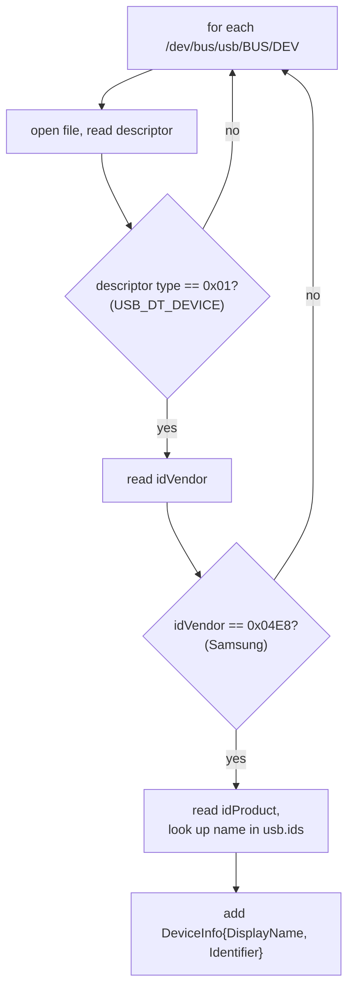

# The USB Transport (native usbfs, no libusb)

> Source of truth: [`Communication/IHandler.cs`](../TheAirBlow.Thor.Library/Communication/IHandler.cs),
> [`Communication/USB.cs`](../TheAirBlow.Thor.Library/Communication/USB.cs),
> [`Communication/DeviceInfo.cs`](../TheAirBlow.Thor.Library/Communication/DeviceInfo.cs),
> [`Platform/Linux.cs`](../TheAirBlow.Thor.Library/Platform/Linux.cs).

## The interesting bit first

Thor does **not** use libusb, WinUSB, or any USB library. On Linux it talks to the kernel's
`usbfs` directly — it opens `/dev/bus/usb/BBB/DDD` as a plain file, reads the raw USB
descriptors byte by byte to find the right endpoints, then drives every transfer through
`ioctl()` calls via P/Invoke into `libc`. This is the single biggest reason Thor exists as
a rewrite: the README notes that **official Odin-for-Linux also uses DevFS**, and devices
that fail under Heimdall's libusb path often work under this native one. Matching Odin's
transport quirk-for-quirk is the whole point.

The trade-off is bluntly stated in the code and the README: it is **Linux-only** today, and
you must run as root (or add a udev rule) because raw `/dev/bus/usb` access is privileged.

## The contract: `IHandler`

Everything protocol-side (`Odin.cs`) talks only to this interface, never to Linux directly.
That's the seam a Windows or macOS port would implement.

```csharp
public interface IHandler {
    string GetNotes();                                   // platform setup hints
    List<DeviceInfo> GetDevices();                       // enumerate Samsung devices
    void Initialize(string? id, byte[]? direct = null);  // open + claim, OR parse a blob
    bool IsConnected();
    void Disconnect();
    void BulkWrite(byte[] buf, int timeout = 5000, bool zlp = false);
    byte[] BulkRead(int amount, out int read, int timeout = 5000);
    void SendZLP();                                      // zero-length packet out
    void ReadZLP();                                      // zero-length packet in
}
```

`USB.cs` is the tiny registry that picks an implementation by platform:

```csharp
public const int Vendor = 0x04E8;   // Samsung's USB vendor ID
_handlers = { { PlatformID.Unix, new Linux() } };   // Windows/Mac: not registered → unsupported
```

If `TryGetHandler` returns nothing for your platform, the shell prints "a USB handler wasn't
written for your platform" and exits. That's exactly what happens on Windows/macOS right now.

## Finding a device without a USB library

`GetDevices()` walks `/dev/bus/usb/*/*`, opens each device node, and reads its **device
descriptor** by hand:



The `Identifier` is the device path with the `/dev/bus/usb/` prefix stripped and slashes
turned into colons — e.g. `001:005`. That colon form is what you pass back to `Initialize`,
which reverses it. `DisplayName` comes from the [usb.ids lookup](#the-usbids-lookup).

## Opening & claiming a device (`Initialize`)

This is the heavy method. It does descriptor parsing first, then three privileged ioctls.

### 1. Parse descriptors to find the CDC-data interface

USB descriptors are a packed, self-describing byte stream: a device descriptor, then a
config descriptor, then N interface descriptors, each followed by its endpoint descriptors.
Thor reads them positionally (seeking past fields it doesn't need) and validates the type
byte at each step:

- **Device descriptor** — assert type `0x01`, assert `idVendor == 0x04E8`, read the config
  count.
- **Config descriptor** — assert type `0x02`, read the interface count.
- **Interface descriptors** — for each: read interface number, alternate setting, endpoint
  count, and **interface class**. It tolerates class-specific descriptors (type `0x24`,
  used by CDC) by skipping `len - 2` bytes and continuing.
- **Endpoint descriptors** — assert type `0x05`, assert the transfer type is **bulk**
  (`attributes & 0x03 == 0x02`), and sort by direction: address `> 0x80` is the **read**
  (IN) endpoint, otherwise the **write** (OUT) endpoint.

An interface is accepted only when **all** of these hold:

```csharp
found = clss == 0x0a                 // USB_CLASS_CDC_DATA
     && _readEndpoint.HasValue
     && _writeEndpoint.HasValue
     && validity;                     // every type/bulk assertion passed
```

`0x0a` is the CDC-Data class — Samsung download mode presents as a serial-ish CDC device,
and its data interface is the one carrying the bulk endpoints Odin needs. If no interface
qualifies, `Initialize` throws "Failed to find valid endpoints!".

### 2. Take the device from the kernel

Once the endpoints are known, Thor switches from reading the descriptor file to owning the
device via `libc`:

| Step | ioctl / call | Why |
|------|--------------|-----|
| Open | `open(path, O_RDWR)` | get a real fd for ioctls |
| Detect driver | `USBDEVFS_GETDRIVER` | is a kernel driver (e.g. `cdc_acm`) bound? |
| Detach it | `USBDEVFS_IOCTL` → `USBDEVFS_DISCONNECT` | kick the kernel driver off so we can talk raw |
| Claim | `USBDEVFS_CLAIMINTERFACE` | take exclusive ownership of the interface |

The detach is why the README tells you to blacklist or unload `cdc_acm`: if the kernel's
serial driver grabs the phone first, Thor has to pry it loose, and on some setups that
doesn't stick. `_detached` is remembered so `Dispose` can hand the interface back.

### 3. The debug side-door

`Initialize(null, direct: bytes)` runs the **descriptor parser only**, against an in-memory
blob instead of a real device, and returns before any ioctl. That's what the shell's
`devParse <file>` command uses — dump a `/dev/bus/usb` node to a file, feed it in, and watch
the descriptor-walk logging without needing the phone attached. Pure diagnostics.

## Transfers: `BulkWrite` / `BulkRead`

Both marshal a `BulkTransfer` struct and issue `USBDEVFS_BULK`. They use `unsafe fixed`
pointers to hand the kernel a stable address for the buffer:

```csharp
struct BulkTransfer { uint Endpoint; uint Length; uint Timeout; nint Data; }
```

- `BulkWrite` sends `buf.Length` bytes to the write endpoint.
- `BulkRead(amount, out read, …)` reads up to `amount` bytes from the read endpoint and
  returns a **right-sized** array — `read` is the actual byte count the kernel reported,
  and the returned array is trimmed to it. That's why Odin can ask for 8 and reason about
  exactly how many came back.
- Default timeout is **5000 ms**; callers override it for slow operations (see the
  [protocol timeout table](odin-protocol.md#timeouts-all-in-milliseconds)).

Both throw `InvalidOperationException` if called while not connected, and route ioctl
failures through `HandleError`, which reads `errno`, converts it with `strerror`, and throws
`"<message>: <errno text> (<code>)"`.

## The Zero-Length-Packet quirk (and a dormant path)

USB uses **zero-length packets** (ZLPs) to signal "end of transfer" when data lands exactly
on a packet boundary. Thor exposes both directions:

- **`ReadZLP()`** is used for real — `Odin.DumpPIT` calls it to drain the endpoint after the
  last PIT block, wrapped in `try/catch` because not every device sends one.
- **`SendZLP()` / the auto-ZLP-after-write path is currently dormant.** `BulkWrite` will send
  a trailing ZLP *only if* the private field `_writeZlp` is true, and it self-disables that
  field the first time it fails. But **nothing in the current code ever sets `_writeZlp` to
  true** — it defaults to `false`. So today, writes never auto-append a ZLP, and `SendZLP`
  has no caller.

**Why document a dormant path?** Because it's a deliberate hook for a device that *needs*
write-side ZLPs, and a port that "cleans up unused code" would delete exactly the mechanism
some stubborn device may require. It's a named gap, not dead weight — leave it wired.

## The ioctl number machinery

`Interop` rebuilds Linux's `_IOR`/`_IOW`/`_IOWR`/`_IO` macros in C# to compute the magic
ioctl request numbers at runtime from direction bits, a type char (`'U'` for usbfs), a
command number, and the argument struct's size. For example:

```csharp
USBDEVFS_BULK = _IOWR('U', 2, sizeof(BulkTransfer));   // read+write, type 'U', nr 2
```

This must exactly match `<linux/usbdevice_fs.h>`, so the constants (`nr` values 2, 4, 8,
15, 16, 18, 20, 22, 23) are copied from the kernel header. Get one wrong and the kernel
rejects the call — there is no partial-credit here.

## Teardown (`Dispose`)

Reverse order, each step guarded so a failure in one doesn't skip the next:

1. `USBDEVFS_RELEASEINTERFACE` — release the claim.
2. `USBDEVFS_CONNECT` — reattach the kernel driver, **only if** Thor detached it.
3. `close(fd)` — close the handle.

This is also why the README warns you can't reuse a USB connection after ending an Odin
session without rebooting the phone — the download-mode endpoint doesn't cleanly re-open.

## What a Windows/macOS port must supply

The seam is small and clean. A new platform means: one `IHandler` implementation +
registering it in `USB.cs`. Concretely it must replicate:

- device enumeration filtered to vendor `0x04E8`,
- discovery of the CDC-data (`0x0a`) bulk IN/OUT endpoints,
- bulk read/write with a timeout and an accurate returned-length,
- ZLP read (and, ideally, the optional ZLP-write hook),
- claim/detach/reattach semantics for that OS (WinUSB on Windows; IOKit on macOS).

Everything above `IHandler` — the entire Odin protocol and PIT logic — is already
platform-agnostic and would come along for free.

## Verified vs. inferred

- **Verified:** the descriptor-walk logic, the `0x0a`/bulk/`0x04E8` filters, the exact ioctl
  set, the `_writeZlp`-defaults-false dormancy, and the teardown order — all from source.
- **Inferred:** that "official Odin uses DevFS and thus works where Heimdall doesn't" is
  quoted from the README, not independently confirmed here. The claim that some devices
  *require* write-side ZLPs is the code author's implied rationale for the dormant hook, not
  something this repo demonstrates.
- **Next unknown:** which real device (if any) needs `_writeZlp = true`. That's the missing
  data point that would justify wiring the dormant path to something.

See also: [Odin protocol](odin-protocol.md) · [shell](shell.md).
